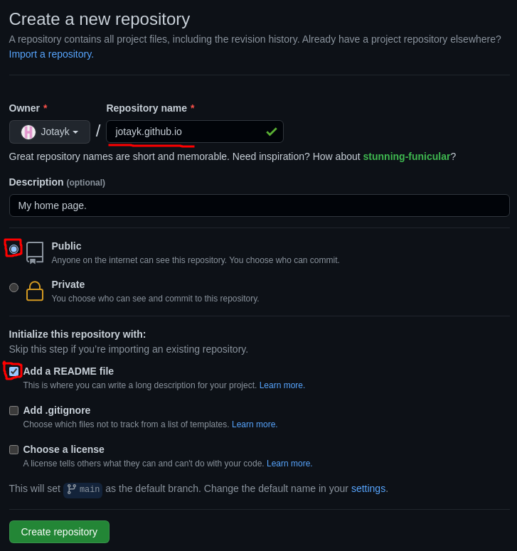
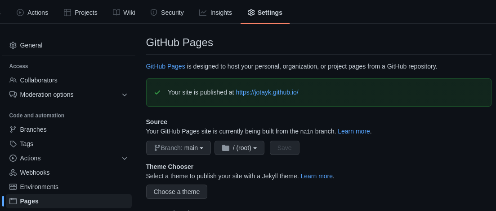
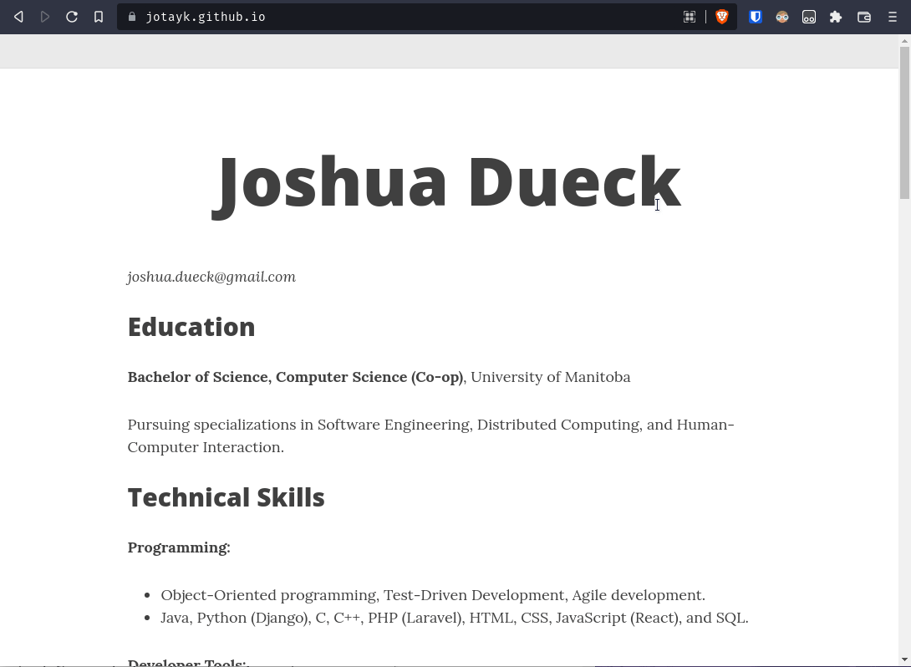

# Joshua Dueck's Resume

## Purpose
It is important that software develpers host an up-to-date, easily-readable resume. This README's purpose is to teach a fairly basic approach to hosting a resume using Markdown, Jekyll, and GitHub Pages, as well as direct you to some valuable information presented in Andrew Etter's book, "Modern Technical Writing".

## Prerequisites
* A Markdown-formatted resume. 
* A GitHub account.
* Git installed on your computer.
* Microsoft VS Code.

## Instructions
Markdown is a light-weight file format that allows users to write **plain-text** files that can easily be converted into HTML to be styled and displayed in a browser. Jekyll is a tool that is used to generate **static websites** from Markdown files. Git is a distributed version control system that allows you to track changes to files, and **GitHub Pages** hosts Git repositories in the form of a static website. If you want to learn more about any of these tools, see the [more resources](#more-resources) section.

### 1. Create a New Pages Repository on GitHub
1. Click the **"New"** button under the "Repositories" tab of your GitHub profile.

2. Name the repository `[username].github.io`, where `[username]` is your GitHub username.
   1. The description should describe the repository on a high level.
   2. The repository should be **public**.
   3. It is beneficial for you to add a README to your repository.
   4. Andrew Etter, in his book "Modern Technical Writing" (see [more resources](#more-resources) below) recommends using a README to explain what the repository is for, and what kinds of **dependencies** may be required. Writing a README is a great way to provide context for visitors and contributors to your repository.

3. Navigate to **"Settings > Pages"** on your repository to ensure that it is live on GitHub Pages from the main branch.
   1. GitHub Pages should automatically publish repositories with the name format `[username].github.io`.


### 2. Clone the Pages Repository
1. Navigate to whatever directory you will be downloading this repository to in your terminal. For me (using Linux), the command to do this is `cd ~/technology/projects`.
2. Clone the repository using SSH by running the command `git clone git@github.com:[username]/[username].github.io`.
   1. If you do not know how to set up an SSH key with your GitHub account, you can follow the instructions on the [GitHub documentation](https://https://docs.github.com/en/authentication/connecting-to-github-with-ssh/adding-a-new-ssh-key-to-your-github-account).

### 3. Create the Jekyll Configuration File
1. Open VS Code to your project's directory.
2. Create a new file in this directory called `_config.yml`.
   1. GitHub Pages automatically uses Jekyll to generate static websites from Markdown files.
   2. This config file is used to tell GitHub how to create your static website using Jekyll.
   3. Andrew Etter explains that static website are a fast, simple, portable, and secure solution for displaying changing information to the public. When compared to PDFs, static websites are much easier to maintain, update, and distribute.
3. Put the following lines in the `_config.yml` file:
    ```yaml
    remote_theme: daattali/beautiful-jekyll@5.0.0
    name: ""
    title: null
    ```
    1. `remote_theme` adds a theme to the page. This is optional, and can be replaced with a different theme if you find one you like more.
    2. `name: ""` and `title: null` work to remove the built-in name from the page, which makes it look a bit cleaner for the purpose of a resume. This is also optional, and you may instead choose to set these values to something else if you prefer.

### 4. Create the Index File
1. Create a new file in your repository called `index.md`.
2. Insert the following at the top of the file, replacing `[your name]` with your name.
    ```yaml
    title: "[your name]"
    name: "[your name]"
    ```
3. Copy the text from from your Markdown-formatted resume into `index.md`.
    1. Andrew Etter praises the use of a lightweight markup language like Markdown for how compact it is, how readable it is in raw-form, and how easy it is to learn. Markdown makes it easy to write structured data, perfect for use on the web.

### 5. Commit and Push your Changes
1. Use the terminal to add your changes to prepare for commit by running the following command in your git repository directory: `git add .`.
2. Commit the changes in your working directory with the command `git commit -m "My descriptive commit message!"`. Your commit message should describe the changes you made.
3. Push the changes to GitHub with the command `git push`.

Your resume should now be live on GitHub Pages at the URL `[username].github.io`! Congratulations!



## More Resources
* [GitHub Markdown Guide](https://docs.github.com/en/get-started/writing-on-github/getting-started-with-writing-and-formatting-on-github/basic-writing-and-formatting-syntax) 
* [About Jekyll - Tom Johnson](https://idratherbewriting.com/about-jekyll/)
* [Git and GitHub - Tom Johnson](https://idratherbewriting.com/trends/trends-to-follow-or-forget-git-and-github.html#what-is-git-and-github)
* [Modern Technical Writing - Andrew Etter](https://www.amazon.ca/Modern-Technical-Writing-Introduction-Documentation-ebook/dp/B01A2QL9SS/ref=sr_1_1?crid=34CWJJ01OLN9L&keywords=andrew+etter&qid=1647982469&sprefix=andrew+ette%2Caps%2C80&sr=8-1)

## Authors & Acknowledgements
* "Beautiful Jekyll" theme by [Dean Attali](https://github.com/daattali/beautiful-jekyll)
* Thank you to my group members ... for reviewing my assignment

## FAQs
> Why is Markdown better than a word processor?

Since Markdown is stored as a plain-text file, it is extremely portable and can be human-readable without any proprietary program, so long as you have a text-editor or viewer. Furthermore, since markdown uses simple in-text notation to imply structure and formatting, many different styles can be easily applied over-top of Markdown files .
<br>

> Why is my resume not updating after I push my changes?

It often takes a few minutes before GitHub Pages can build and deploy a new version of your website after you push a commit. You can view the current status of your most recent deployment via the deployment page for your website repository: www.github.com/[username]/[username].github.io/deployments/.
